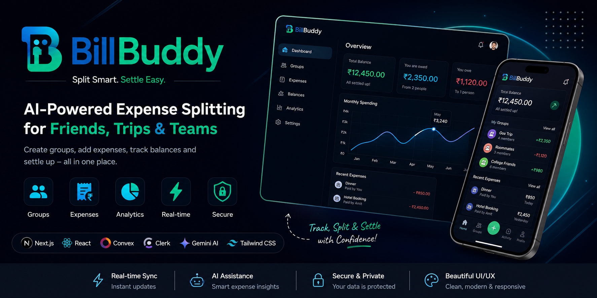

<p align="center">
  
</p>

# 
#


<div align="center">

# 💸 BillBuddy - AI Powered Smart Expense Splitting Platform

Modern • Secure • Real-Time • Responsive

<p align="center">


</p>

</div>

---

# ✨ Overview

BillBuddy is a modern AI-powered expense splitting platform inspired by Splitwise.

It allows users to:

- 👥 Create Groups
- 💰 Split Expenses
- 📊 Track Spending
- ⚡ Real-time Balance Updates
- 🤖 AI Assistance
- 🔐 Secure Authentication

---

# 🚀 Live Demo

**Live Website**

https://bill-buddy-vert.vercel.app/
**Repository**

https://github.com/Ankit-iiitkota/BillBuddy

---

# 🌟 Features

- 👥 Group Expense Management
- 💰 Individual & Shared Expenses
- 📊 Expense Analytics Dashboard
- ⚡ Real-time Sync (Convex)
- 🔐 Clerk Authentication
- 🤖 Gemini AI Integration
- 🌙 Dark Mode UI
- 📱 Responsive Design
- 📅 Multiple Split Types
- 💳 Balance Tracking

---

# 📸 Screenshots

## 🏠 Landing Page


---

## 📊 Dashboard


---

## 💰 Add Expense


---

## ✨ Features


---

## ⚡ How It Works


---

# 🏗 Architecture

```text
             Next.js
                │
                ▼
      Clerk Authentication
                │
                ▼
        Convex Backend
                │
                ▼
      Expense Management
                │
                ▼
    Recharts + Gemini AI
                │
                ▼
              Vercel
```

---

# 🛠 Tech Stack

| Category | Technology |
|----------|------------|
| Frontend | Next.js 15, React 19 |
| Styling | Tailwind CSS v4 |
| Backend | Convex |
| Database | Convex |
| Authentication | Clerk |
| AI | Gemini AI |
| Charts | Recharts |
| Deployment | Vercel |

---

# 📂 Folder Structure

```text
BillBuddy
│
├── app
├── components
├── convex
├── hooks
├── lib
├── public
├── screenshots
├── middleware.js
├── package.json
└── README.md
```

---

# ⚙️ Installation

Clone the repository

```bash
git clone https://github.com/Ankit-iiitkota/BillBuddy.git
```

Go to project

```bash
cd BillBuddy
```

Install dependencies

```bash
npm install
```

Run development server

```bash
npm run dev
```

Open your browser

```
http://localhost:3000
```

---

# 🔑 Environment Variables

Create a `.env.local`

```env
CONVEX_DEPLOYMENT=

NEXT_PUBLIC_CONVEX_URL=

NEXT_PUBLIC_CLERK_PUBLISHABLE_KEY=

CLERK_SECRET_KEY=

NEXT_PUBLIC_CLERK_SIGN_IN_URL=/sign-in

NEXT_PUBLIC_CLERK_SIGN_UP_URL=/sign-up

CLERK_JWT_ISSUER_DOMAIN=

RESEND_API_KEY=

GEMINI_API_KEY=
```

---

# 🚀 Build

```bash
npm run build
```

---

# 📈 Future Roadmap

- 📸 OCR Receipt Scanner
- 💳 UPI Integration
- 🤖 AI Expense Insights
- 📄 PDF Reports
- 🔔 Push Notifications
- 🌍 Multi Currency Support
- 🎤 Voice Expense Entry

---

# 🤝 Contributing

```bash
git checkout -b feature/amazing-feature

git commit -m "Add amazing feature"

git push origin feature/amazing-feature
```

---

# 👨‍💻 Author

**Ankit Chaurasiya**

🎓 IIIT Kota

**GitHub**

https://github.com/Ankit-iiitkota

**LinkedIn**

https://linkedin.com/in/YOUR-LINK

**Portfolio**

https://YOUR-PORTFOLIO

---

<div align="center">

## ⭐ Support

If you found this project useful,

⭐ Star this repository

🍴 Fork it

🚀 Share it

---

Built with ❤️ using Next.js, Convex, Clerk & Gemini AI

</div>
