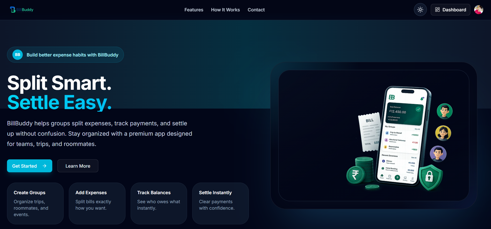
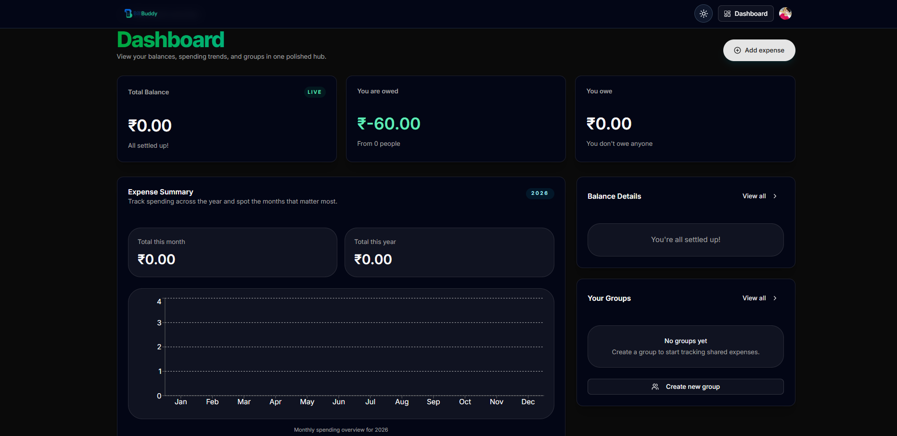
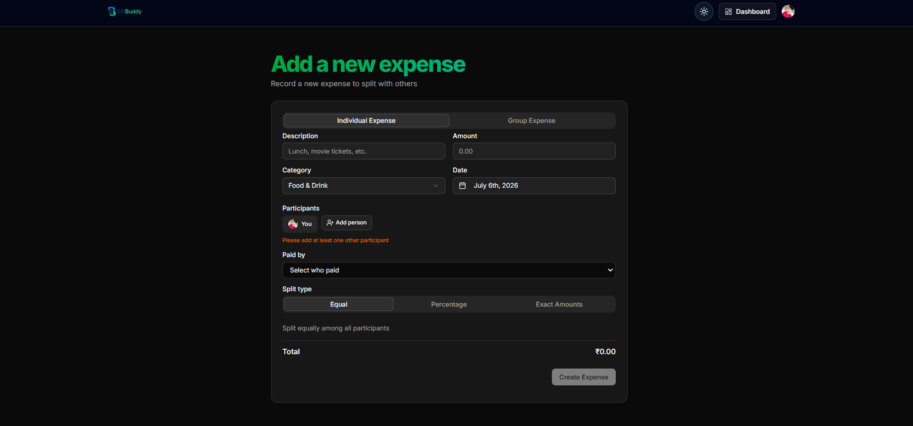
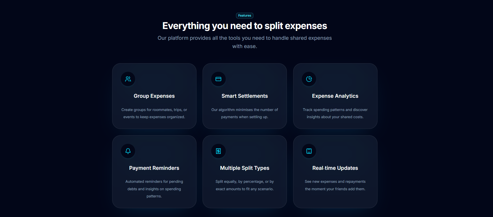
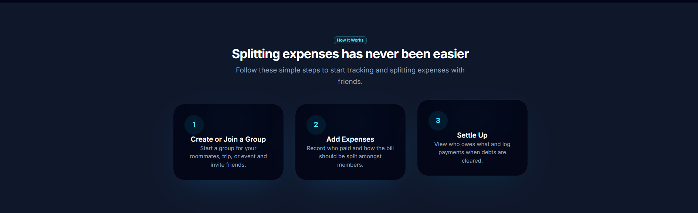

# 💸 BillBuddy - AI Powered Smart Expense Splitting Platform

Modern • Real-Time • Secure • Beautiful UI

## 🚀 Live Demo

🌐 Live Website

https://bill-buddy-vert.vercel.app/

📂 Repository

https://github.com/Ankit-iiitkota/BillBuddy

BillBuddy is a modern AI-powered expense splitting platform
designed for roommates, friends, trips and teams.

Track expenses, settle debts, monitor spending trends,
and collaborate in real time using Convex.

Built with a production-ready architecture using
Next.js App Router, Clerk Authentication,
Convex Backend and Gemini AI.

|    |                        |
| -- | ---------------------- |
| 👥 | Group Management       |
| 💰 | Expense Splitting      |
| ⚡  | Real-time Updates      |
| 📊 | Expense Analytics      |
| 🔐 | Clerk Authentication   |
| 🤖 | Gemini AI              |
| 🌙 | Dark Theme             |
| 📱 | Responsive Design      |
| 📅 | Multiple Split Methods |
| 💳 | Balance Tracking       |

## Landing Page

## Dashboard

## Add Expense

## Features

## How It Works

          Next.js

              │

     Clerk Authentication

              │

         Convex Backend

              │

      Expense Management

              │

     Recharts + Gemini AI

              │

           Vercel

| Frontend | Backend | Database | Authentication | AI     | Deployment |
| -------- | ------- | -------- | -------------- | ------ | ---------- |
| Next.js  | Convex  | Convex   | Clerk          | Gemini | Vercel     |

BillBuddy

app/
components/
convex/
hooks/
lib/
public/

middleware.js
package.json
README.md

git clone https://github.com/Ankit-iiitkota/BillBuddy.git

cd BillBuddy

npm install

npm run dev

CONVEX_DEPLOYMENT=

NEXT_PUBLIC_CONVEX_URL=

NEXT_PUBLIC_CLERK_PUBLISHABLE_KEY=

CLERK_SECRET_KEY=

NEXT_PUBLIC_CLERK_SIGN_IN_URL=/sign-in

NEXT_PUBLIC_CLERK_SIGN_UP_URL=/sign-up

CLERK_JWT_ISSUER_DOMAIN=

RESEND_API_KEY=

GEMINI_API_KEY=

npm run build

git checkout -b feature/amazing-feature

git commit -m "Added amazing feature"

git push origin feature/amazing-feature

Ankit Chaurasiya

IIIT Kota

LinkedIn:
https://linkedin.com/in/......

Portfolio:
https://.......

GitHub:
https://github.com/Ankit-iiitkota

If you found this project useful,

⭐ Star the repository

🍴 Fork it

🚀 Share it

